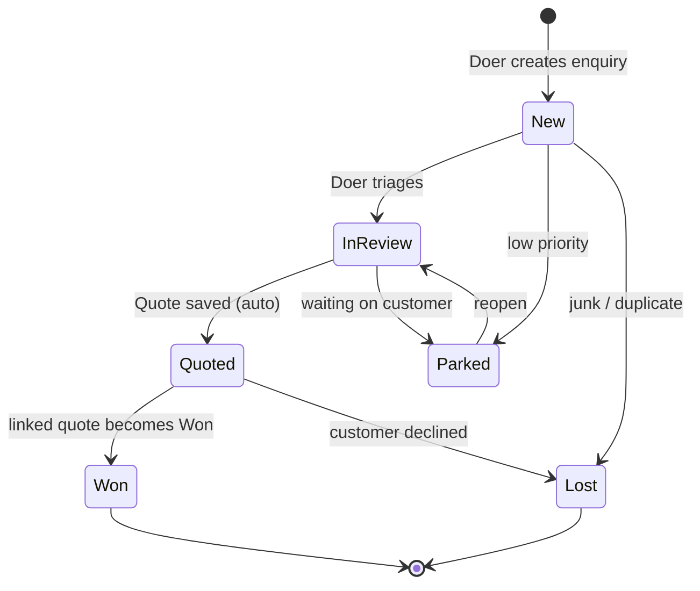
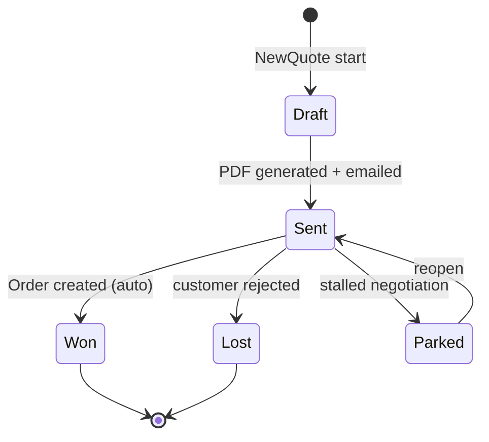
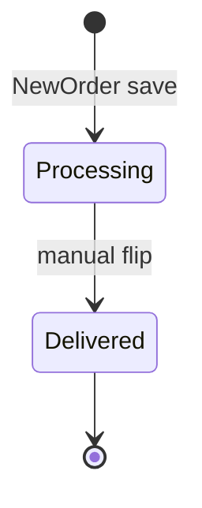
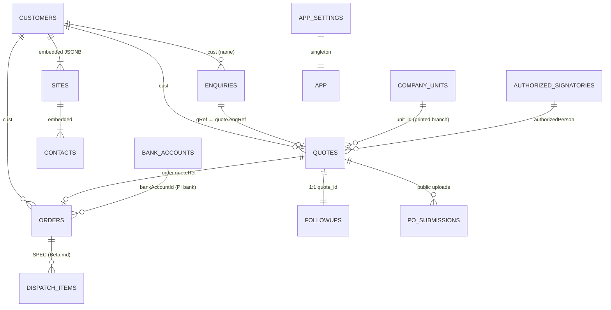
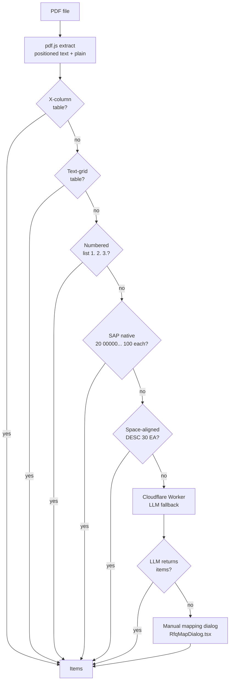
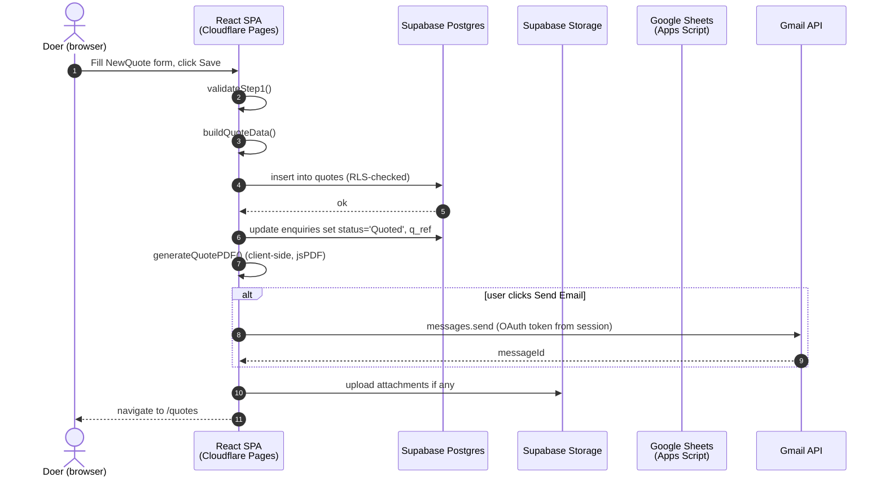
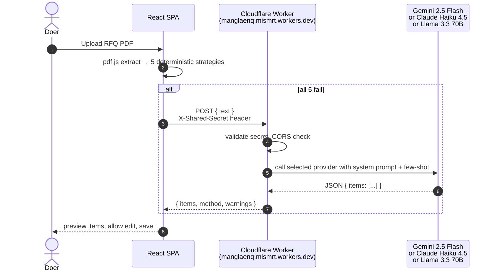
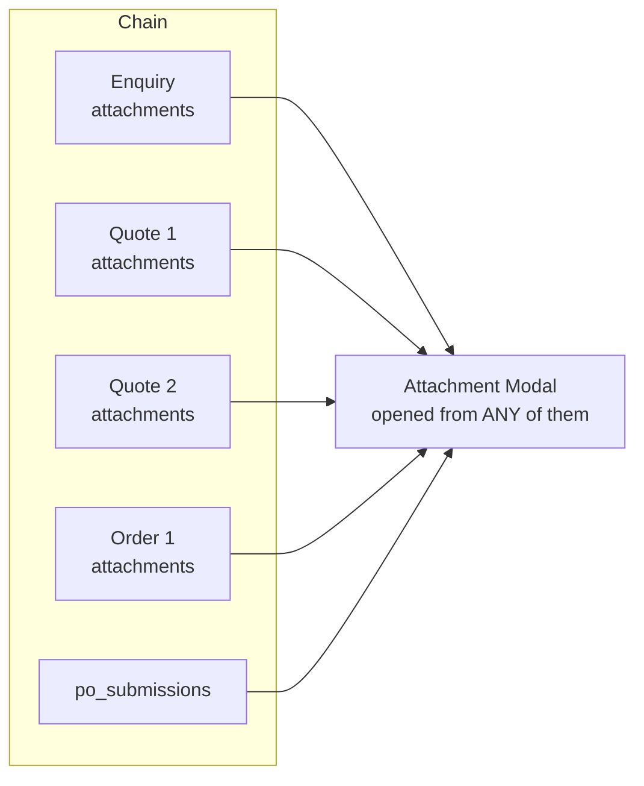

# EnqBoss — Complete Process Map

End-to-end specification of the Mangla Rubbers enquiry-to-order CRM. Covers
business flow (what users do), data flow (how records relate), and technical
architecture (what runs where). Mermaid diagrams render natively in GitHub,
VSCode preview, and most Markdown viewers.

---

## 0. Quick orientation

| Layer | Tech | Where |
|---|---|---|
| Frontend SPA | React 18 + Vite + TS + Tailwind | `EnqBoss/EnqBoss_new/` |
| Hosting | Cloudflare Pages | `https://enq2po.pages.dev` |
| Database + Auth | Supabase (Postgres + Google OAuth) | `src/lib/supabase.ts` |
| Object storage | Supabase Storage (S3-compatible) | `src/lib/s3.ts` |
| Email | Gmail API (read + send) | `src/lib/gmail.ts` |
| Spreadsheet export | Google Apps Script webhook | `src/lib/sheets.ts` |
| RFQ PDF parsing | pdf.js (in-browser) + Cloudflare Worker LLM fallback | `src/lib/rfqParser.ts`, `parse_rfq_worker/` |
| Auth gate | `@manglarubbers.com` domain whitelist | `src/store/index.tsx:90` |

Three principal user roles (all the same Google login — distinction is in *what they do*, not permissions):
- **MIS / Doer** — logs enquiries, creates quotes, manages follow-ups, generates PDFs.
- **Customer** — public PO-submission link (no auth).
- **Admin** — same login; uses Settings for company units, signatories, bank accounts, integrations.

---

## 1. End-to-end business flow

```mermaid
flowchart LR
  A[Customer sends RFQ<br/>email / PDF / phone] --> B{New Enquiry<br/>page}
  B -->|RFQ PDF upload| C[pdf.js parses table<br/>5 strategies + LLM fallback]
  C --> D[Enquiry saved<br/>status: New]
  B -->|manual entry| D
  D --> E{Doer reviews}
  E -->|valid| F[status: In Review]
  E -->|junk / dup| G[status: Lost / Parked]
  F --> H[Create Quote<br/>NewQuote page]
  H --> I[Quote saved + PDF generated<br/>enquiry.status auto → Quoted]
  I --> J[Send email to customer<br/>SendEmailModal via Gmail]
  J --> K{Customer<br/>response}
  K -->|negotiation| L[Follow-up log<br/>WhatsApp / Call / Email]
  L --> K
  K -->|PO received| M[Customer opens public link<br/>/submit-po/:quoteId]
  M --> N[PO PDF uploaded to<br/>po_submissions table]
  K -->|PO direct| O[Doer creates Order<br/>NewOrder page]
  N --> O
  O --> P[Order saved<br/>quote.status auto → Won<br/>PI PDF generated]
  P --> Q[Order exported to Google Sheets<br/>Apps Script generates Job Card]
  Q --> R[Production module<br/>SPEC ONLY — Beta.md]
```



Notes on the flow:

- **Status auto-transitions** (in code, not UI clicks):
  - Quote created → linked enquiry's `status` flips to `Quoted` and `qRef` is set ([NewQuote.tsx:344](EnqBoss/EnqBoss_new/src/pages/NewQuote.tsx#L344)).
  - Order created → linked quote's `status` flips to `Won` ([NewOrder.tsx:241](EnqBoss/EnqBoss_new/src/pages/NewOrder.tsx#L241)).
- **No `Order → Delivered` automation yet** — Dispatch module is spec-only in `Beta.md`, not built.
- **Public PO upload** is the only non-authenticated surface in the app. The customer never sees the CRM.

---

## 2. Status state machines

### 2.1 Enquiry status (`EnqStatus`)



Source: [types.ts:1](EnqBoss/EnqBoss_new/src/lib/types.ts#L1) — `'New' | 'In Review' | 'Quoted' | 'Won' | 'Lost' | 'Parked'`.

**Urgency** (independent of status): `Hot | Urgent | Normal | Low` with SLA hours `4 | 24 | 48 | 72` ([Dashboard.tsx:305](EnqBoss/EnqBoss_new/src/pages/Dashboard.tsx#L305)). Breaches show up in *Needs Attention* and SLA dashboards.

### 2.2 Quote status (`QuoteStatus`)



`'Draft' | 'Sent' | 'Won' | 'Lost' | 'Parked'` ([types.ts:3](EnqBoss/EnqBoss_new/src/lib/types.ts#L3)).

### 2.3 Order status (`OrderStatus`)



Minimal today: `'Processing' | 'Delivered'` ([types.ts:4](EnqBoss/EnqBoss_new/src/lib/types.ts#L4)). The full Dispatch / Job-Card lifecycle (`Ready to Dispatch`, `Partially Dispatched`, etc.) is specified in [Beta.md](Beta.md) but not yet implemented.

---

## 3. Data model

### 3.1 Entity relationship



### 3.2 Tables (Supabase Postgres)

Defined in [supabase_schema.sql](EnqBoss/EnqBoss_new/supabase_schema.sql). All have RLS `auth.jwt() ->> 'email' LIKE '%@manglarubbers.com'`.

| Table | Key columns | Purpose | Computed-at-read fields |
|---|---|---|---|
| `customers` | `id`, `code`, `name`, `sites JSONB` | Master customer list; sites/contacts nested as JSONB | — |
| `enquiries` | `id`, `recv`, `cust`, `site_id`, `urg`, `status`, `items JSONB`, `q_ref` | One per RFQ | `ageH` derived live from `recv` ([store/index.tsx:146](EnqBoss/EnqBoss_new/src/store/index.tsx#L146)) |
| `quotes` | `id`, `enq_ref`, `cust`, `site_id`, `date`, `validity`, `status`, `items JSONB`, `terms` | One per quotation | totals (sub/gst/grand) computed in [pdfGenerator.ts:7](EnqBoss/EnqBoss_new/src/lib/pdfGenerator.ts#L7) |
| `orders` | `id`, `quote_ref`, `enq_ref`, `site_id`, `po_no`, `po_date`, `dlv_date`, `status`, `value`, `items JSONB` | One per PO | — |
| `followups` | `id (= quote_id)`, `owner`, `next_date`, `next_time`, `status`, `logs JSONB` | 1:1 with quote, tracks contact attempts | — |
| `po_submissions` | `id`, `quote_id`, `storage_path`, `created_at` | Customer-uploaded POs via public link | linked into order in [store/index.tsx:698](EnqBoss/EnqBoss_new/src/store/index.tsx#L698) |
| `authorized_signatories` | `id`, `name`, `designation`, `phone`, `is_default` | Whose name prints on quote/PI PDFs | — |
| `company_units` | `id`, `name`, `address`, `gstin`, `header_url`, `sig_url`, `is_default`, `signatory_id` | Multi-branch letterhead support | — |
| `bank_accounts` | `id`, `bank_name`, `account_no`, `ifsc`, `is_default` | Pre-filled into PI PDFs | — |
| `app_settings` | singleton `id = 'config'` | Shared toggles (sig, header, sheet URLs) | — |

> **Append-only convention** is documented for Production tables in `Beta.md`, **not** for the current Enquiry/Quote/Order tables — those are mutable.

### 3.3 The `data` store (in-memory mirror)

[store/index.tsx](EnqBoss/EnqBoss_new/src/store/index.tsx) hydrates one object at boot, exposes CRUD that round-trips to Supabase:

```ts
data: {
  enquiries: Enquiry[],
  quotes: Quote[],
  orders: Order[],
  customers: Customer[],
  followups: FollowUp[],
  signatories: AuthorizedSignatory[],
  units: CompanyUnit[],
  bankAccounts: BankAccount[],
  settings: AppSettings | null,
}
```

Every page reads from `useAppStore().data`. Mutations call `addX`/`updateX`/`deleteX` which write to Supabase first, then update local state. **Local cache lives only in memory** — refresh re-fetches from DB. No service worker / offline mode.

### 3.4 Foreign-key chain (the "spine")

```
CUSTOMERS.name ←─ ENQUIRIES.cust ──→ ENQUIRIES.id
                                      ↑
                                      └── QUOTES.enqRef ──→ QUOTES.id
                                                            ↑
                                                            └── ORDERS.quoteRef
```

`site_id` on Enquiry/Quote/Order references a site inside `customers.sites JSONB` (not a separate table). The whole chain is plain string IDs — no UUIDs, no joins; everything resolves by `find()` in memory.

---

## 4. Module-by-module spec

### 4.1 Dashboard ([Dashboard.tsx](EnqBoss/EnqBoss_new/src/pages/Dashboard.tsx))

**Purpose:** at-a-glance MDO view.

**Tabs:** Overview / MDO / Calendar / Pipeline.

**5 KPI cards** with rotating sub-text (15-second cycle, current → vs last week → vs last month):
1. Avg E2Q Time (Enquiry → Quote hours). *Inverse* — lower is better.
2. Open Pipeline (₹ value of `Sent` quotes).
3. Q→O Conversion (% of period's quotes that became orders).
4. Quotes Sent (count in period).
5. Quote Value (₹ in period).

**Panels:** Needs Attention (SLA-breached open enquiries), Recent Enquiries, Recent Quotations, Open Quote Value by Customer, Enquiry Sources donut, Pipeline Funnel.

**MDO panel** lists: pending follow-ups (this week), overdue enquiries (past SLA), quotes awaiting decision (Sent 7+ days), open orders past delivery date.

### 4.2 Enquiries ([Enquiries.tsx](EnqBoss/EnqBoss_new/src/pages/Enquiries.tsx))

Register with tabs `All / Open / New / In Review / Quoted / Won / Lost / Parked`. Columns: ENQ No., Received, Customer–Site/Branch, Source, Items, Urgency, Status, Age, Quote Ref, Actions.

Click row → expandable line-item view. Action buttons: Edit, Detail, Convert to Quotation.

### 4.3 New Enquiry ([NewEnquiry.tsx](EnqBoss/EnqBoss_new/src/pages/NewEnquiry.tsx))

Two paths:

**Manual** — fill customer, urgency, items table; save.

**RFQ PDF upload** — file → [parseRfqPdf()](EnqBoss/EnqBoss_new/src/lib/rfqParser.ts) waterfall:



Items are previewed in a table before save. On save: enquiry row created with `status: 'New'`, attachments uploaded to S3.

### 4.4 Quotes ([Quotes.tsx](EnqBoss/EnqBoss_new/src/pages/Quotes.tsx)) + New Quote ([NewQuote.tsx](EnqBoss/EnqBoss_new/src/pages/NewQuote.tsx))

**Register:** Quote No., ENQ Ref, Customer–Site/Branch, Date, Items, Value (ex GST), Grand Total, Status, Valid Until, Actions.

**Form layout (Step 1):**
1. Customer + Site + Contact cascading dropdowns. Cascading auto-fills inco / curr / pay from customer master.
2. Items table (loaded from enquiry if `?enqRef=...`). Per-item: seq, desc, mat, hsn, qty, uom, unit price, gst%, total. Notes section (numbered).
3. T&C editor (defaults from `tnc.ts`).
4. Authorized signatory selector + unit (branch) selector.
5. Cust enquiry doc no. (their reference).

**Form layout (Step 2):** preview + Save / Generate PDF.

**Side effects on save (NewQuote.tsx:333-347):**
- `addQuote` → insert into `quotes`.
- If `enqRef` set: `updateEnquiry(enqRef, { status: 'Quoted', qRef: quoteId })`.
- If customer doesn't exist in master: `addCustomer` creates skeleton.

**PDF generation:** [generateQuotePDF()](EnqBoss/EnqBoss_new/src/lib/pdfGenerator.ts) — uses unit's header + signatory's sig image, prints `Cust + Site name + address` block below header.

### 4.5 Orders ([Orders.tsx](EnqBoss/EnqBoss_new/src/pages/Orders.tsx)) + New Order ([NewOrder.tsx](EnqBoss/EnqBoss_new/src/pages/NewOrder.tsx))

**Register:** Order No., Quote Ref, Customer–Site/Branch, PO Number, PO Date, Items, Order Value, Delivery By, Status, Actions. PO download button in PO No. cell.

**Form:** similar to NewQuote but adds PO upload, ship-to address, bank account selector, EXIM fields (priceBasis, eximCode, customPoint, PAN, HSN).

**Side effects on save (NewOrder.tsx:234-243):**
- `addOrder` → insert into `orders`.
- If quoteRef: `updateQuote(quoteRef, { status: 'Won' })`.
- PO file uploaded to S3 if provided.

**Generate PI** → [generatePIPDF()](EnqBoss/EnqBoss_new/src/lib/pdfGenerator.ts) — performa invoice format with bank details + ship-to.

**Export to Google Sheets** ([sheets.ts](EnqBoss/EnqBoss_new/src/lib/sheets.ts)): POSTs order payload to an Apps Script webhook which appends a row to a Job Card sheet. Marks `sheetsExportedAt` on the order.

### 4.6 Submit PO — public ([SubmitPO.tsx](EnqBoss/EnqBoss_new/src/pages/SubmitPO.tsx))

Route: `/submit-po/:quoteId`. **No auth.**

Flow:
1. Page loads quote by `quoteId` from a public `quotes_public_view` (or RLS-relaxed read).
2. Customer drops PDF / image / Word doc.
3. Uploads to `po-uploads` bucket as `{quoteId}_{epoch}.{ext}`.
4. Inserts row in `po_submissions { quote_id, storage_path }`.
5. Doer next sees the submission on the Attachments dialog of that quote/order; `linkPendingPOSubmissions` ([store/index.tsx:698](EnqBoss/EnqBoss_new/src/store/index.tsx#L698)) auto-attaches it to the matching order if one exists.

Send-link button on the quote register copies `https://enq2po.pages.dev/submit-po/{quoteId}` for sharing.

### 4.7 Follow-ups ([FollowUps.tsx](EnqBoss/EnqBoss_new/src/pages/FollowUps.tsx))

One follow-up record **per quote** (1:1, `id = quote_id`). Tracks:
- `owner` (assignee), `next_date` + `next_time` (when to check back), `status: 'open' | 'closed'`.
- `logs[]`: each entry = `{ ts, who, channel, note, nextDate?, nextChannel? }` where channel ∈ `Called | WhatsApp | Email | Meeting | Visit`.

UI:
- Kanban-ish list grouped by `Due today / Overdue / This week / Later / Closed`.
- "Log Contact" prompt records a log entry and optionally schedules next.
- WhatsApp button opens `wa.me/{phone}` with a templated message.
- Email button opens [SendEmailModal](EnqBoss/EnqBoss_new/src/components/SendEmailModal.tsx) which sends via Gmail API.

**No scheduler in-app.** "Due today" filters by `next_date <= today`. To get reminders, the user has to open the page (or the dashboard's MDO panel).

### 4.8 Customers ([Customers.tsx](EnqBoss/EnqBoss_new/src/pages/Customers.tsx)) + New Customer ([NewCustomer.tsx](EnqBoss/EnqBoss_new/src/pages/NewCustomer.tsx))

Master data with nested sites (each with own address, GSTIN, contacts). Sites are the "branch/plant" picker that appears on Enquiry/Quote/Order forms.

Includes customer-level fields: segment, default Incoterm, currency, payment terms, tier, ratings (payment / orders / trend → composite score).

### 4.9 Analytics ([Analytics.tsx](EnqBoss/EnqBoss_new/src/pages/Analytics.tsx))

Charts & rankings — top customers by revenue, win-rate by segment, conversion funnel by month, SLA compliance.

### 4.10 Intelligence Board ([IntelligenceBoard.tsx](EnqBoss/EnqBoss_new/src/pages/IntelligenceBoard.tsx))

Customer-tier dashboard — ABC tiering, "next likely products" predictions, churn risk.

### 4.11 Blueprint ([Blueprint.tsx](EnqBoss/EnqBoss_new/src/pages/Blueprint.tsx))

Live schema/ERD viewer — counts per table, FK map, SLA targets. Used as ops dashboard.

### 4.12 Settings ([Settings.tsx](EnqBoss/EnqBoss_new/src/pages/Settings.tsx))

Sub-pages for:
- **Authorized Signatories** CRUD.
- **Company Units** (branches) — name, address, GSTIN, header image, sig image; mark default.
- **Bank Accounts** for PI.
- **App Settings** singleton — Gmail labels for sync, Sheets webhook URL, default Inco, etc.

### 4.13 Login ([Login.tsx](EnqBoss/EnqBoss_new/src/pages/Login.tsx))

Single button → Google OAuth via Supabase. Post-login, [store/index.tsx:90](EnqBoss/EnqBoss_new/src/store/index.tsx#L90) checks the email domain; non-`@manglarubbers.com` users see an error and are signed out.

---

## 5. Technical architecture

### 5.1 Request flow (typical "save quote" call)



### 5.2 RFQ-fallback request flow



### 5.3 Auth boundary

```mermaid
flowchart LR
  subgraph Public
    P1[/submit-po/:quoteId/]
  end
  subgraph Authenticated
    A1[/]
    A2[/enquiries]
    A3[/quotes]
    A4[/orders]
    A5[/customers]
    A6[/followups]
    A7[/settings]
    A8[/analytics]
    A9[/intelligence]
    A10[/blueprint]
  end
  P1 --> SB[(Supabase<br/>RLS-relaxed read of quote)]
  P1 --> S3[(Storage<br/>po-uploads bucket)]
  P1 --> POS[(po_submissions<br/>insert)]
  A1 --> G[Google OAuth → JWT]
  G --> D[@manglarubbers.com gate<br/>store/index.tsx:90]
  D --> SB2[(Supabase<br/>full RLS access)]
```

### 5.4 File / module map

```
EnqBoss/EnqBoss_new/
├── src/
│   ├── App.tsx                 ← router (15 routes)
│   ├── store/index.tsx         ← Zustand-style data store + Supabase CRUD
│   ├── pages/                  ← 16 page components (see §4)
│   ├── components/
│   │   ├── Layout.tsx          ← sidebar + topbar + outlet
│   │   ├── DetailPanel.tsx     ← slide-over for enq/quote/order
│   │   ├── AttachmentModal.tsx ← cross-chain document viewer (§6.1)
│   │   ├── RfqMapDialog.tsx    ← manual column mapping when parser fails
│   │   ├── SendEmailModal.tsx  ← Gmail send with template
│   │   ├── FollowUpSendPrompt.tsx
│   │   └── …
│   └── lib/
│       ├── supabase.ts         ← client + auth helpers
│       ├── s3.ts               ← upload + signed-URL helpers
│       ├── gmail.ts            ← fetch labelled emails, send
│       ├── sheets.ts           ← Apps Script webhook POST
│       ├── pdfGenerator.ts     ← generateQuotePDF + generatePIPDF
│       ├── rfqParser.ts        ← 5 strategies + LLM fallback
│       ├── types.ts            ← all TS types + status enums
│       └── utils.ts            ← formatINR, calculateAgeHours, …
├── supabase_schema.sql         ← DB DDL + RLS policies
└── public/
parse_rfq_worker/               ← Cloudflare Worker for LLM fallback
├── src/index.ts                ← provider dispatcher (CF / Claude / Gemini)
├── wrangler.toml               ← LLM_PROVIDER var
└── package.json
parse_rfq/                      ← Python FastAPI (legacy, not currently used)
└── main.py
Beta.md                         ← Production/Dispatch SPEC (unbuilt)
PROCESS_MAP.md                  ← this document
```

---

## 6. Cross-cutting behaviours

### 6.1 Document visibility (Attachment Modal)

`AttachmentModal` (re-implemented earlier) makes attachments **globally visible across the enq→quote→order chain**:



Algorithm: resolve root enquiry from entry point → find all quotes referencing that enquiry → all orders referencing those quotes → merge `attachments` arrays + matching `po_submissions` rows (dedupe by storage path). Upload still targets the current entity.

### 6.2 PDF parsing waterfall

Already shown in §4.3. Note the *deterministic-first, LLM-last* design — the LLM only ever sees PDFs the regex + X-column strategies couldn't crack, keeping cost near zero.

### 6.3 SLA & age computation

`enquiry.ageH` is **derived live** from `recv` ([store/index.tsx:146](EnqBoss/EnqBoss_new/src/store/index.tsx#L146)) — the stored `age_h` column is treated as legacy and not trusted. SLA breach test: `ageH >= SLA_H[urg]` where `SLA_H = { Hot: 4, Urgent: 24, Normal: 48, Low: 72 }`. Drives "Needs Attention" and dashboards' "Inbox Zero".

### 6.4 Customer–Site/Branch consistency

When `siteId` is set on a quote or order, all downstream artifacts respect it:
- Registers display `Customer — Site Name`.
- Quote/PI PDFs print the site's full address + GSTIN.
- Fallback chain: explicit `quote.siteId` → linked enquiry's `siteId` → customer's `isPrimary` site → `sites[0]`.

### 6.5 Multi-unit (branch) letterhead

`company_units` carries `header_url` + `sig_url`. The active unit on a quote/order drives which letterhead image gets stamped into PDFs ([pdfGenerator.ts](EnqBoss/EnqBoss_new/src/lib/pdfGenerator.ts) — `unit?.header_url || settings?.header_url || localStorage.getItem('mrt_header_img')`). One default unit per app; per-quote override allowed.

### 6.6 Gmail integration

Two modes:
- **Inbox sync** — [fetchLabelledEmails()](EnqBoss/EnqBoss_new/src/lib/gmail.ts) reads messages with a configured label (e.g. `Enquiry`) using `gmail.readonly` scope. Used to pre-fill NewEnquiry from an email thread, including PDF attachments via `fetchEmailAttachments()`.
- **Send** — `SendEmailModal` composes from a template (quote PDF as base64 attachment) and sends with `gmail.send` scope.

OAuth token is the same Supabase Google session token, scoped at sign-in time.

### 6.7 Google Sheets export

On order save, optional POST to an Apps Script Web App URL ([sheets.ts](EnqBoss/EnqBoss_new/src/lib/sheets.ts)). The script appends a row to a *Job Card* sheet and a *Pending Invoice* sheet. App marks `orders.sheets_exported_at = now()` on success — the Orders register shows a green check on exported orders.

This is the only place the current app overlaps with the (unbuilt) Production module's expected inputs.

---

## 7. Integration matrix

| External system | Direction | Trigger | Failure mode | Auth |
|---|---|---|---|---|
| Supabase Postgres | R/W | every page | toast + rollback local state | Google OAuth JWT, RLS by email domain |
| Supabase Auth | R | Login, refresh | redirect to Login | Google OAuth |
| Supabase Storage | W (attachments, POs) | Upload buttons | toast, file kept in browser | session-scoped |
| Gmail API | R (sync) / W (send) | Manual click | toast, no retry | OAuth scopes `gmail.readonly` + `gmail.send` |
| Apps Script (Sheets) | W | Order save | silent failure tolerated | URL secret |
| Cloudflare Worker (RFQ LLM) | R | PDF parse fallback | empty items → manual dialog | shared-secret header + CORS allowlist |
| Anthropic / Gemini / Workers AI | R | inside the Worker | Worker returns 500 | API key as Cloudflare secret |
| pdf.js | local | RFQ upload | manual dialog | n/a |

---

## 8. Known gaps & what's specced but not built

| Gap | Spec | Status |
|---|---|---|
| Production pipeline (Job Cards → Molding → Finishing → Inspection) | [Beta.md](Beta.md) §2-3 | Not built |
| Dispatch board + invoice multi-line | [Beta.md](Beta.md) §4.5-4.6 | Not built |
| Complaint module (referenced from Dispatch) | Beta.md §10 | Not built |
| Order status flow beyond `Processing / Delivered` (Partially Dispatched, etc.) | Beta.md §3.2 | Not built |
| Reminders / cron for due follow-ups | Inferred need | Manual today (open dashboard) |
| Append-only mutation policy on Enquiry/Quote/Order | Beta.md §1 principle | Tables are mutable |
| RFQ parser regression tests | Implicit need | None |

---

## 9. Glossary

| Term | Meaning |
|---|---|
| RFQ | Request For Quotation — customer's PDF/email asking us to quote |
| E2Q | Enquiry-to-Quote time in hours |
| Q→O | Quote-to-Order conversion rate |
| PI | Performa Invoice — pre-payment doc generated against an order |
| PO | Purchase Order — customer's confirmation document |
| MOC | Material of Construction (e.g. EPDM, NBR, FFKM, Viton) |
| SLA | Service-Level Agreement — max acceptable response hours by urgency |
| MDO | Marketing & Dispatch Operations — the doer role |
| Unit | A company branch with its own GSTIN and letterhead |
| Site | A customer's specific delivery/billing location |
| Doer | Internal user fulfilling enquiries |

---

## 10. Where to look next

- For implementation history & decisions: `git log`.
- For Production/Dispatch architecture: [Beta.md](Beta.md).
- For DB schema source of truth: [supabase_schema.sql](EnqBoss/EnqBoss_new/supabase_schema.sql).
- For RFQ parser tuning: [rfqParser.ts](EnqBoss/EnqBoss_new/src/lib/rfqParser.ts) + [parse_rfq_worker/src/index.ts](parse_rfq_worker/src/index.ts).
- For status & enum definitions: [types.ts](EnqBoss/EnqBoss_new/src/lib/types.ts).
- For all CRUD wiring: [store/index.tsx](EnqBoss/EnqBoss_new/src/store/index.tsx).
